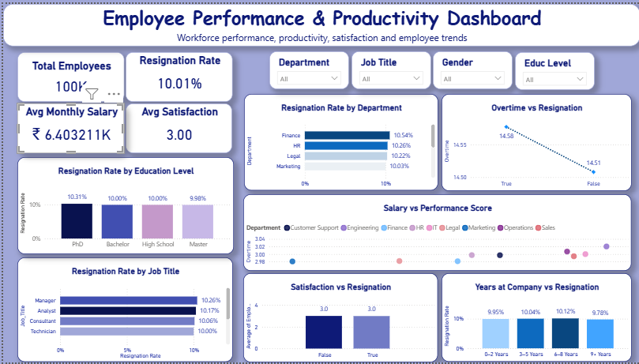

# HR Analytics: Employee Performance & Attrition

An end-to-end HR analytics project combining a Python/pandas exploratory analysis and an interactive Power BI dashboard, built on the **Onyx Data – DataDNA Dataset Challenge: Employee Performance and Productivity Dataset (October 2024)**.


---

## 📌 Project Overview

**Business question:** What drives employee attrition — and can it be predicted from standard HR metrics like department, education, workload, satisfaction, performance, and pay?

**Dataset:** 100,000 employee records, 20 columns, covering:
- Demographics — Department, Gender, Age, Job Title, Education Level
- Tenure — Hire Date, Years at Company
- Performance & workload — Performance Score, Work Hours/Week, Projects Handled, Overtime Hours, Remote Work Frequency, Team Size, Training Hours, Promotions
- Compensation & wellbeing — Monthly Salary, Sick Days, Employee Satisfaction Score
- Outcome — Resigned (True/False)

**Approach:**
1. Clean/inspect the data (shape, dtypes, duplicates) in Python
2. Explore attrition rates across departments, education levels, and job titles
3. Compare resigned vs. current employees across satisfaction, overtime, performance, salary, and tenure
4. Visualize workload and training patterns
5. Build an interactive Power BI dashboard for stakeholder-facing exploration

---

## 🔑 Key Findings

1. **Overall attrition sits at ~10%** (10,010 of 100,000 employees).
2. **No department stands out** — attrition ranges from 9.56% (IT) to 10.54% (Finance), under a 1-point spread across all 9 departments.
3. **Education level has almost no effect** — PhD holders resign marginally more often (10.31%) than other groups (~9.98–10.00%), a gap too small to call a real driver.
4. **Satisfaction, overtime, performance, salary, and tenure are statistically similar** between resigned and current employees (all differences under 0.5%). None of the usual "obvious" attrition drivers separate leavers from stayers in this dataset.
5. **Workload and training patterns are flat** — hours worked doesn't scale with projects handled, and top performers don't receive meaningfully more training than lower performers.

**Takeaway:** Attrition in this dataset behaves close to randomly with respect to the variables captured. Practically, this suggests that department-, performance-, or compensation-based attrition risk models would have little predictive power here — an organization would need to look at factors outside this dataset (manager quality, career growth, external offers, team dynamics) to understand *why* people actually leave.

*(Note: this is a synthetic/challenge dataset built for a data analytics competition, so the near-uniform attrition rate across every slice is itself an interesting/expected finding for a simulated dataset — it's called out explicitly rather than over-interpreted as a real-world result.)*

---

## 📊 Power BI Dashboard

`Employee_Performance_Dashboard.pbix` is an interactive companion dashboard built on the same dataset, including:
- KPI cards (headline metrics: headcount, attrition rate, avg. performance, avg. satisfaction)
- Attrition breakdowns by department and job title (bar/column charts)
- Trend view of hires/attrition over time (line chart)
- Salary vs. performance scatter plot
- Slicers to filter by department, gender, education level, and job title

> Open `Employee_Performance_Dashboard.pbix` in [Power BI Desktop](https://powerbi.microsoft.com/desktop/) (free) to explore interactively.



---

## 🗂️ Repo Structure

```
├── notebooks/
│   └── Project_2_HR_Analytics.ipynb      # Python EDA: cleaning, attrition analysis, charts
├── dashboard/
│   └── Employee_Performance_Dashboard.pbix
├── screenshots/                           # Dashboard page exports (add your own)
└── README.md
```

---

## 🛠️ Tools & Libraries

- **Python:** pandas, numpy, matplotlib
- **BI:** Power BI Desktop
- **Data source:** [Onyx Data DataDNA Challenge – Employee Performance and Productivity Dataset (Oct 2024)](https://data.world/) — credit to Onyx Data for the dataset

---

## ▶️ How to Run

```bash
pip install pandas numpy matplotlib openpyxl
jupyter notebook notebooks/Project_2_HR_Analytics.ipynb
```

The notebook expects the source Excel file `Onyx Data - DataDNA Dataset Challenge - Employee Performance and Productivity Dataset - October 2024.xlsx` in the same directory (not included here — see the data source link above).

---

## 📬 Contact

**Shaline S** — [LinkedIn](https://www.linkedin.com/in/shaline06/) · [GitHub](https://github.com/shaline0616) · [shaline0616@gmail.com](shaline0616@gmail.com)
